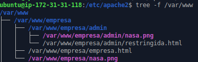

## Reto1. WEB de la empresa

Primero me creo una cuenta en No-Ip y me instalo un cliente de
****Cliente de Actualización Dinámica**** a través de la guía que me da
la propia web de
No-Ip **"westerlund.hopto.org"** es el nombre de host
***

Tras esto podemos elegir el cómo poner en marcha el noip. He usado
la manera de arrancarlo como servicio, entonces para esto he tenido que
irme a **/etc/systemd/system/** y lo he llamado noip2.service con
el siguiente
contenido

Después reiniciamos el daemon con **systemctl daemon-reload** y tras
esto hacemos un **systemctl start noip2** y debería arrancar y podremos
ver su estado, tras esto si funciona tendremos que habilitarlo con
**systemctl enable noip2** y si todo funciona tendría que salir esto:

********

Ahora realizo la parte de tener una web con además una zona segura
con seguridad digest. Entonces, primero me creo la página web en
**/var/www/empresa/** y la zona segura en **/var/www/empresa/admin/**:

Después me copio el **000-default.conf** y lo llamo **empresa.conf** con
la siguiente configuración:

Después por si no lo habías hecho, activas el modulo auth_digest con
**a2enmod auth_digest** para que funcione la autenticación digest y
reinicias el servicio apache2. Posteriormente creamos las credenciales
para la **"Zona Restringida"** (que así es como yo la llamo) con el
siguiente comando:\
\
sudo htdigest -c /etc/apache2/.htpasswd \"Zona Restringida\" pepe

Con esto ya tenemos las credenciales para la zona restringida. Ya
solo nos queda hacer un a2ensite empresa.conf  y poner en
/etc/hosts lo siguiente:

Para ver si funciona en la máquina de la instancia, hagamos un curl
al nombre de dominio y si funciona sale la estructura de la web:\
\

********

Después para obtener el certificado, instalamos certbot, tenemos los puertos 80 y 443 abiertos y ejecutamos el comando **certbot --apache** y seleccionamos nuestro dominio, y con eso tendríamos nuestra web segura porque nos genera nuestra web con los mismos parámetros pero en un ssl.conf. En mi caso lo llamé **empresa-ssl.conf**.
