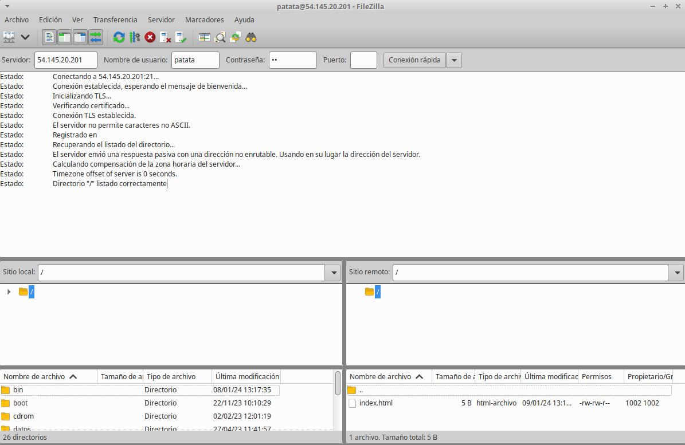

## Reto 2. Servicio de Hosting

\
Primero, creo un usuario nuevo:

Posteriormente, antes de hacer cosas con el usuario nuevo, nos vamos al
archivo userdir.conf y en él vemos el directorio que será para los
usuarios nuevos que por defecto es public_html. Importante además
activar el módulo **userdir** de apache:

\

\

Ese directorio lo tendremos que crear en el usuario nuevo en su home, en
mi caso /**home/usuario** y dentro de él creamos el index.html con la
estructura que le hayamos puesto y tras eso reiniciamos el servidor y
accedemos a la URL en mi caso
[**http://www.empresa.com/**](http://www.empresa.com/~usuario)[****\~****](http://www.empresa.com/~usuario)[****usuario****](http://www.empresa.com/~usuario)
****

\
\
Ahora instalamos el servidor ftp en la instancia para que los
usuarios accedan por
él:****

Tras esto, ahora nos toca configurar lo necesario para realizar lo que
nos pide... Entonces primero voy a empezar con el certificado de
seguridad y posteriormente con el modo pasivo. Para eso, añadiré lo
siguiente en el archivo de configuración del
vsftpd:

Primero he generado el certificado correspondiente en la ruta que se
muestra en ****rsa_cert_file ****y en **rsa_private_key ****y activo
el modulo SSL****, ****tras eso, he ido con el modo pasivo que al final
son tan sólo las tres primeras lineas que empiezan por ****pasv, ****la
primera lo habilita y la ****min_port**** y**** max_port ****lo que
establecen son el rango de puertos que le he designado que además tengo
que añadirlos en las reglas de entrada en la instancia de
AWS

**** Por lo demás, con un ****sub_token ****utilizo la
variable ****\$USER ****para posteriormente en ****local_root****, poner
la ruta en la que quedarán enjaulados todos los usuarios **que yo añada.
El puerto de escucha es el 21.**

Me aseguro de tener bien las reglas de salida también

Después de instalar FileZilla tenemos que configurar un sitio nuevo de
entrada con lo siguiente:

****\
Hay que asegurarse simplemente que se haga la conexión por FTP explícito
sobre TLS, con la IP pública de la instancia.\
\
\
Ahora tras eso me aparece el certificado de servidor
tras intentar establecer la conexión, y si todo ha salido bien podremos
ver el contenido del sitio remoto del
usuario

