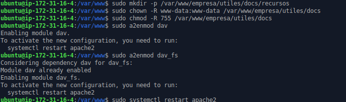
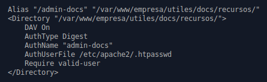
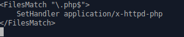
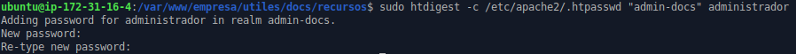
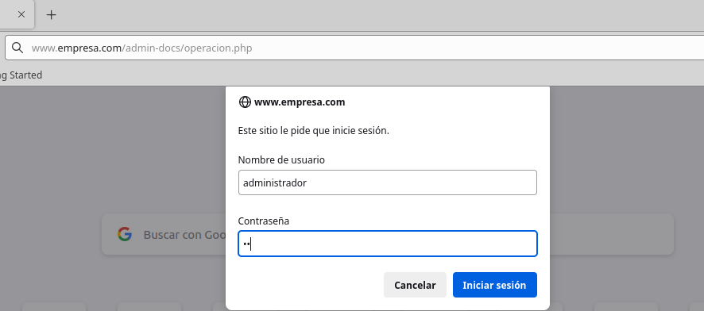
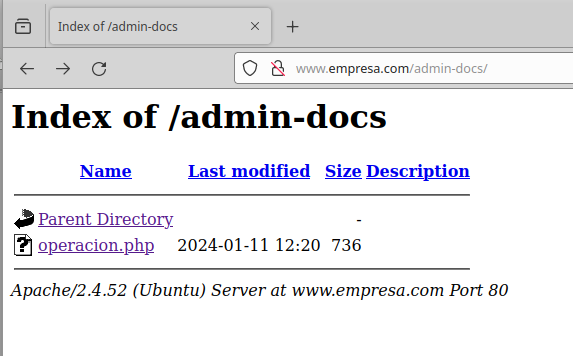

## Reto3. WEB de la empresa. Funcionalidades premium

Primero creo y añado los permisos a los nuevos directorios y
posteriormente activo el modulo **dav** y **dav_fs **y reinicio el
servidor apache. Después instalo php.

Dentro de mi web, añado la nueva ruta que he creado con el DAV activado,
la autenticación Digest y el authname "admin-docs" como pide. Justo
debajo tengo el contenido del fichero htaccess y más abajo hago el
htdigest al usuario administrador para la zona "admin-docs".

