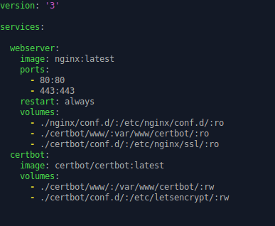
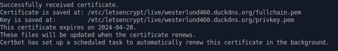
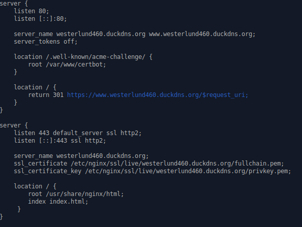
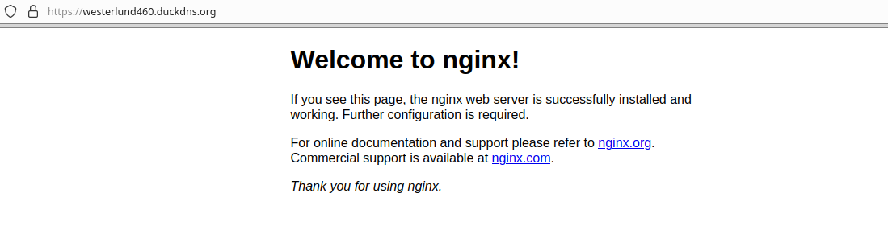

# 
Reto 4. WEB Externa

Voy a utilizar el método docker-compose después de intentar hacerlo de otra forma, así que primero tras haber creado los directorios necesarios para los volúmenes inserto este contenido en mi .yml

 

Tras eso, hago un docker-compose up y después ejecuto el comando sudo docker-compose run --rm  certbot certonly --webroot --webroot-path /var/www/certbot/ -d westerlund460.duckdns.org y me da los certificados:

 

Después voy al fichero de configuración y su contenido me ha quedado así:

 

Y entonces si voy al navegador, veo que mi web es segura

 
