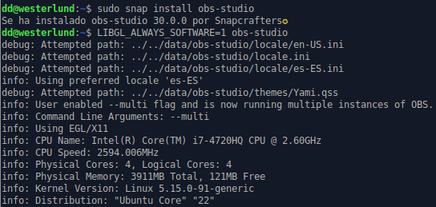
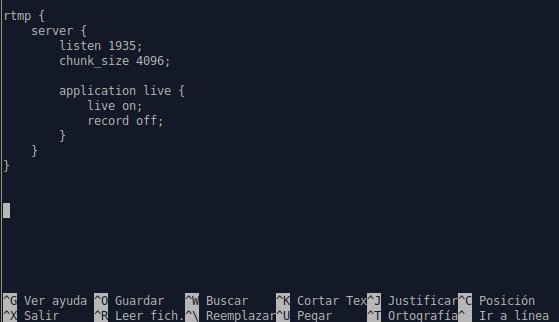
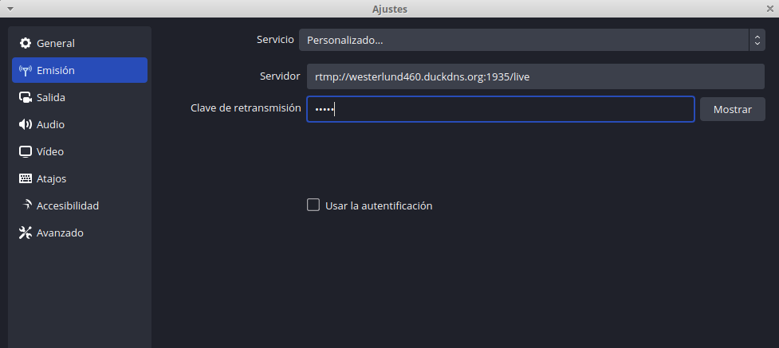
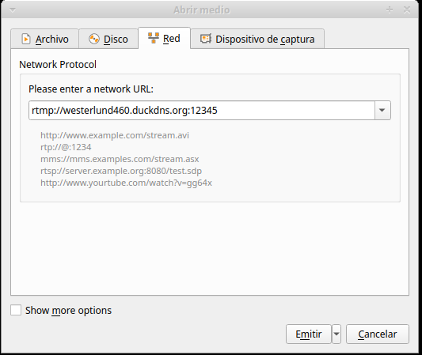

# 
Reto 5. Servidor Streaming

Instalo OBS y habilitamos el módulo libnginx-mod-rtmp, después añadimos el rtmp al final del fichero nginx.conf:

 

 

Me voy a la configuración de OBS y pongo lo siguiente en "Ajustes" en el apartado de "Emisión":

 

Ahora vamos al VLC y en "Medio" > " Abrir ubicación de red" ponemos la siguiente red URL, le damos a iniciar transmisión desde el OBS y después a emitir en el VLC y debería aparecer la transmisión en ambos.

 
