# 
Reto 6. Servidor de correo electrónico

He usado la guía legendaria de server-world.info y he seguido literalmente los pasos que realiza, aquí tienes los links:

# POSTFIX
https://www.server-world.info/en/note?os=Ubuntu_20.04&p=mail&f=1

<code>apt -y install postfix sasl2-bin</code>

<code>cp /usr/share/postfix/main.cf.dist /etc/postfix/main.cf </code>

<code>nano /etc/postfix/main.cf</code>

# línea 78: descomentar

<code>mail_owner = postfix</code>

# línea 94: descomentar y especificar el nombre del host
<code>myhostname = westerlund460.duckdns.org</code>

# línea 102: descomentar y especificar el nombre de dominio
<code>mydomain = westerlund460.duckdns.org</code>

# línea 123: descomentar
<code>myorigin = $mydomain</code>

# línea 137: descomentar
<code>inet_interfaces = all</code>

# línea 185: descomentar
<code>mydestination = $myhostname, localhost.$mydomain, localhost, $mydomain</code>

# línea 228: descomentar
<code>local_recipient_maps = unix:passwd.byname $alias_maps</code>

# línea 270: descomentar
<code>mynetworks_style = subnet</code>

# línea 287: agregar tu red local
<code>mynetworks = 127.0.0.0/8, 10.0.0.0/24</code>

# línea 407: descomentar
<code>alias_maps = hash:/etc/aliases</code>

# línea 418: descomentar
<code>alias_database = hash:/etc/aliases</code>

# línea 440: descomentar
<code>home_mailbox = Maildir/</code>

# línea 650: agregar
<code>smtpd_banner = $myhostname ESMTP $mail_name (Ubuntu)</code>
<code>smtpd_banner = $myhostname ESMTP</code>

# línea 655: agregar
<code>sendmail_path = /usr/sbin/postfix</code>

# línea 660: agregar
<code>newaliases_path = /usr/bin/newaliases</code>

# línea 666: agregar
<code>mailq_path = /usr/bin/mailq</code>

# línea 670: comentar
<code>setgid_group = postdrop</code>

# línea 684: si también escuchas en IPv6, cambiar a [all]
<code>inet_protocols = ipv4</code>

# agregar al final por ejemplo, limitar el tamaño de un correo electrónico a 10M
<code>message_size_limit = 10485760</code>

# Configuración SMTP-Auth
<code>smtpd_sasl_type = dovecot</code>
<code>smtpd_sasl_path = private/auth</code>
<code>smtpd_sasl_auth_enable = yes</code>
<code>smtpd_sasl_security_options = noanonymous</code>
<code>smtpd_sasl_local_domain = $myhostname</code>
<code>smtpd_recipient_restrictions = permit_mynetworks permit_auth_destination permit_sasl_authenticated reject</code>

<code>newaliases</code>

<code>systemctl restart postfix</code>

Tras el puerto 25 se abre.

# DOVECOT
https://www.server-world.info/en/note?os=Ubuntu_20.04&p=mail&f=2

<code>apt -y install dovecot-core dovecot-pop3d dovecot-imapd</code>

<code>nano /etc/dovecot/dovecot.conf</code>

# línea 30: descomentar
<code>listen = *, ::</code>

<code>nano /etc/dovecot/conf.d/10-auth.conf</code>

# línea 10: descomentar y cambiar (permitir autenticación de texto plano)
<code>disable_plaintext_auth = no</code>

# línea 100: agregar
<code>auth_mechanisms = plain login</code>

<code>nano /etc/dovecot/conf.d/10-mail.conf</code> 

 # line 30: Cambia a Maildir
<code>mail_location = maildir:~/Maildir</code>

<code>nano /etc/dovecot/conf.d/10-master.conf</code> 

# line 107-109: descomenta y añade 
  #Postfix smtp-auth

  <code>unix_listener /var/spool/postfix/private/auth {</code>
    <code>mode = 0666</code>
    <code>user = postfix</code>
    <code>group = postfix</code>
  <code>}</code>

  <code>systemctl restart dovecot</code> 

Después de esto instalo mailutils y añado un usuario nuevo en mi caso "westerlund" como lo hace la guía en el apartado "Add Mail User Accounts" en el siguiente link:

# MAIL USER ACCOUNTS

https://www.server-world.info/en/note?os=Ubuntu_20.04&p=mail&f=3

<code>apt -y install mailutils</code>

<code>echo 'export MAIL=$HOME/Maildir/' >> /etc/profile.d/mail.sh</code> 

<code>adduser westerlund</code>

Después de eso, podemos probar a enviar un correo a nosotros mismos y si todo funciona, estos se almacenarán en /Maildir/cur

 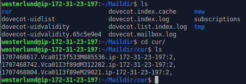

# SSL CERTIFICATES

https://www.server-world.info/en/note?os=Ubuntu_20.04&p=ssl&f=2

<code>apt -y install certbot</code>

Creo el certificado SSL para usar el puerto 587 instalando certbot y ejecutando el siguiente comando tras haber instalado certbot:

<code>certbot certonly --standalone -d westerlund460.duckdns.org</code>

 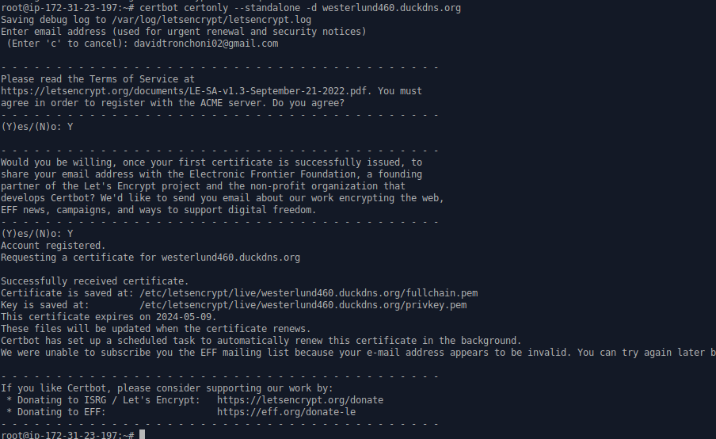

# SSL/TLS SETTINGS

https://www.server-world.info/en/note?os=Ubuntu_20.04&p=mail&f=5

Tras obtener el certificado, debo cambiar el contenido en los ficheros main.cf, master.cf y 10-ssl.conf como hace en la guía:

 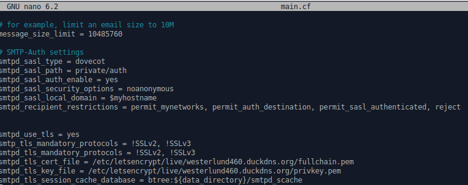

 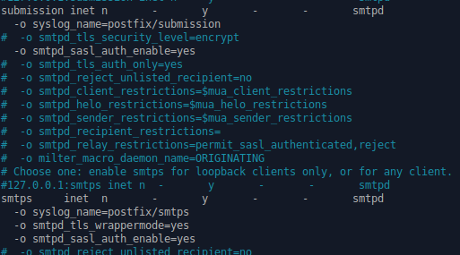

 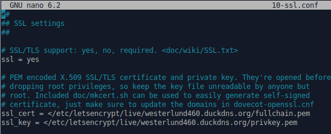

Y ahora reinicamos postfix y dovecot y se nos quedan abiertos los puertos que tocan:

 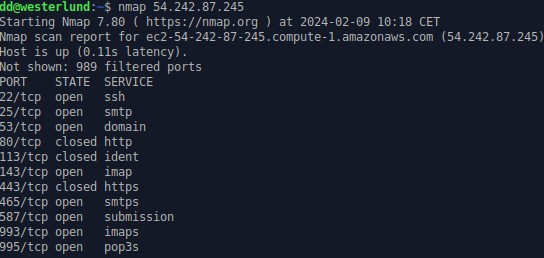

# THUNDERBIRD

Configuramos en el Thunderbird nuestro correo:

 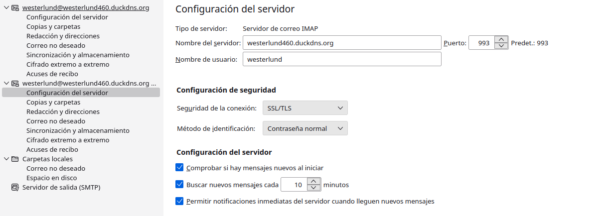

 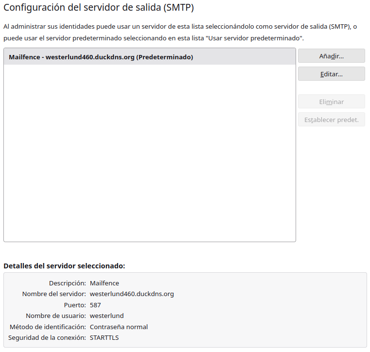

Ahora vamos a la configuración manual para ver si verifica:

 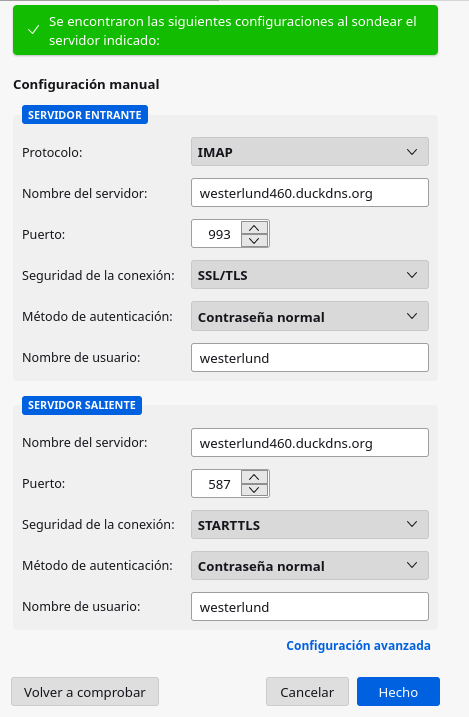

Ahora veremos si tiene en la bandeja de entrada los correos, he mandado un correo a propósito para ver si lo recibe:

 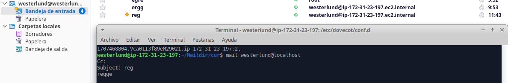

 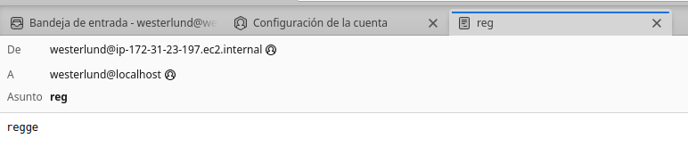
