# 
Reto 7. Monitorización de un servidor

Creamos la red docker y nos bajamos la imagen de prometheus y hacemos el "docker run"

 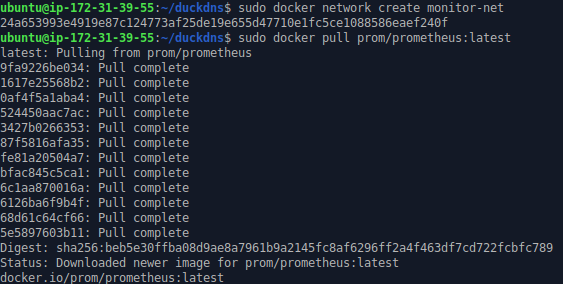

 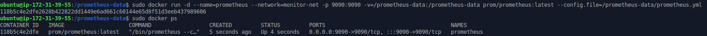

Configuramos lo siguiente para prometheus también:

 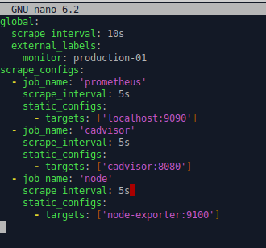

Accedemos a la web:

 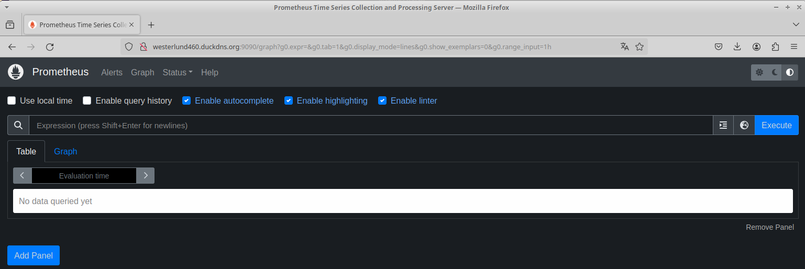

Nos bajamos la imagen de cAdvisor y hacemos el "docker run":

 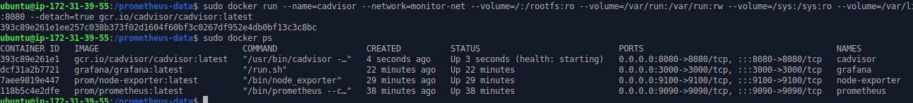

Accedemos a la web:

 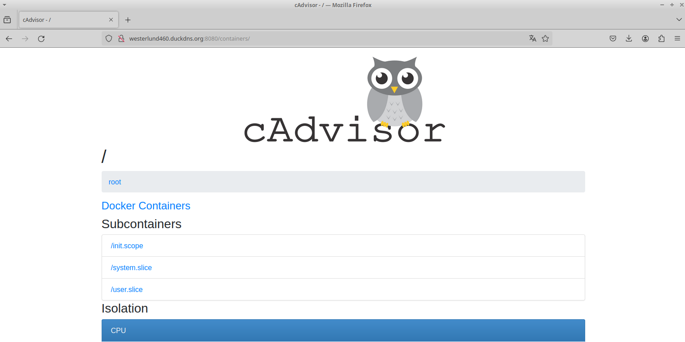

Hacemos un docker run del docker "node-exporter":

 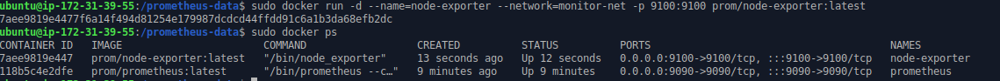

Accedemos a la web:

 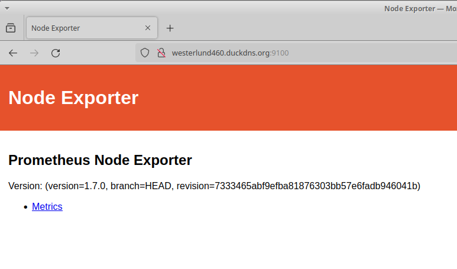

Ahora es el turno de grafana:

 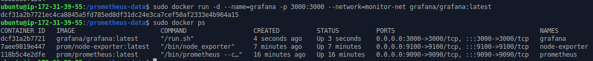

Accedemos a la web:

 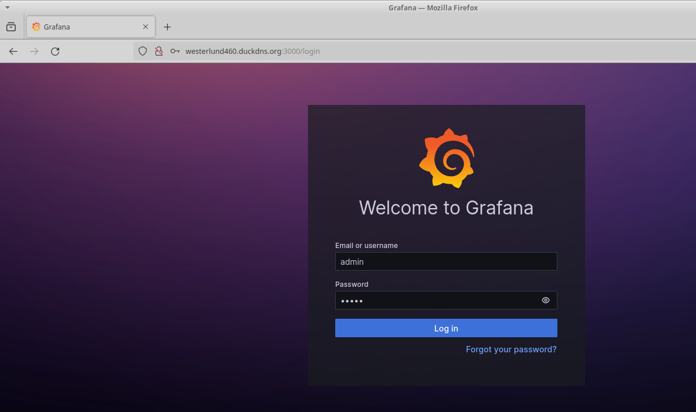

Usamos de credenciales usuario admin y contraseña admin aunque diga que no es seguro y entramos:

 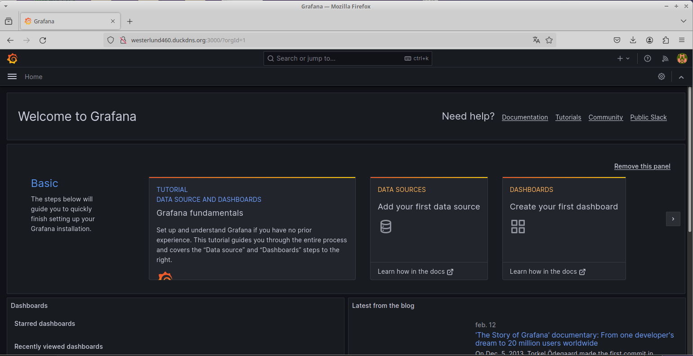

Ahora creamos el dashboard para el prometheus por ejemplo:

 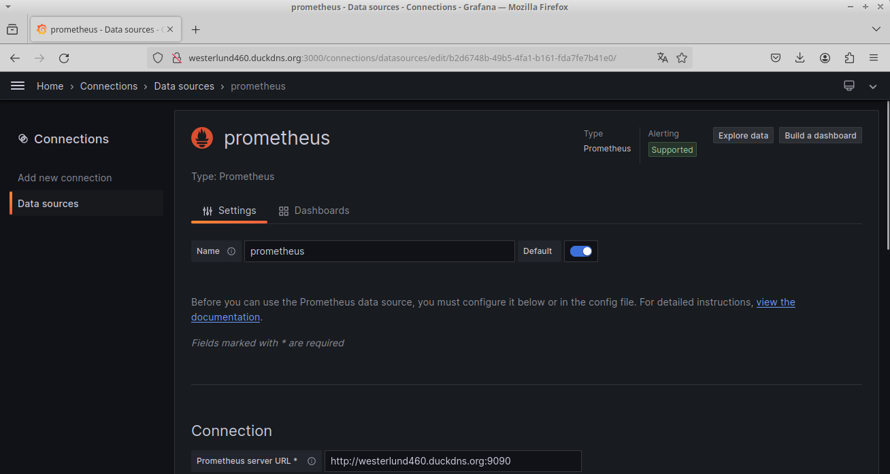

Y si ha funcionado nos sale esto:

 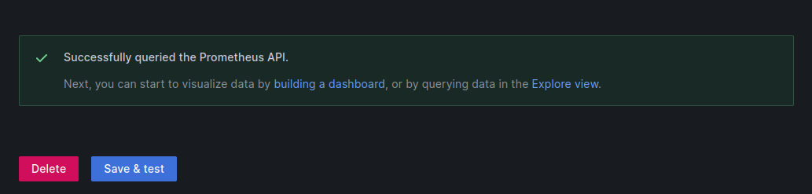

Ahora nos queda importar el dashboard:

 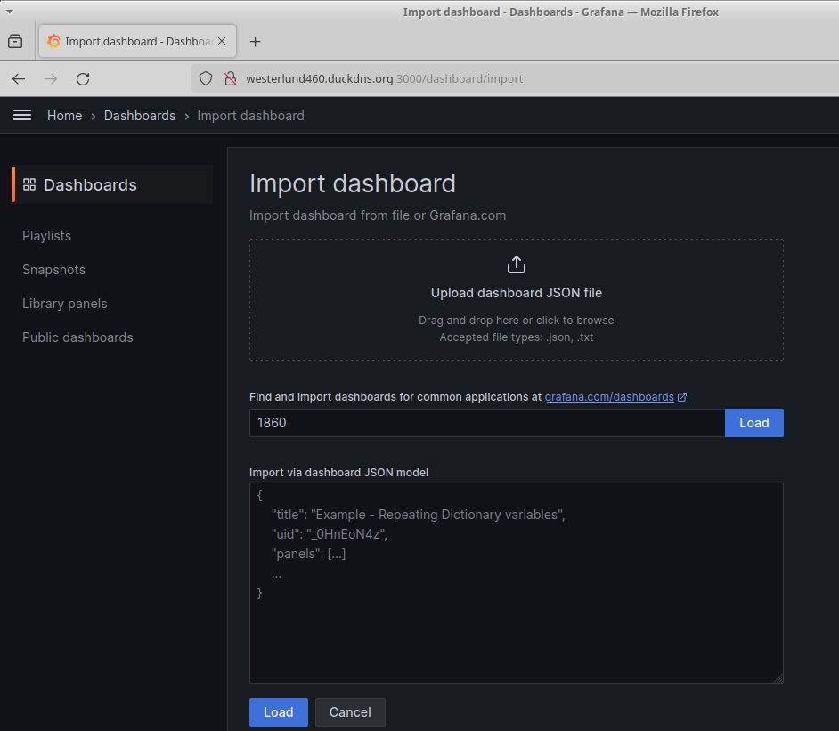

Nos vamos ahora a "Home" > "Dashboards" > "Import dashboard", le damos a "load" a la derecha del "1860" y ya nos debería funcionar y aparecer lo siguiente:

 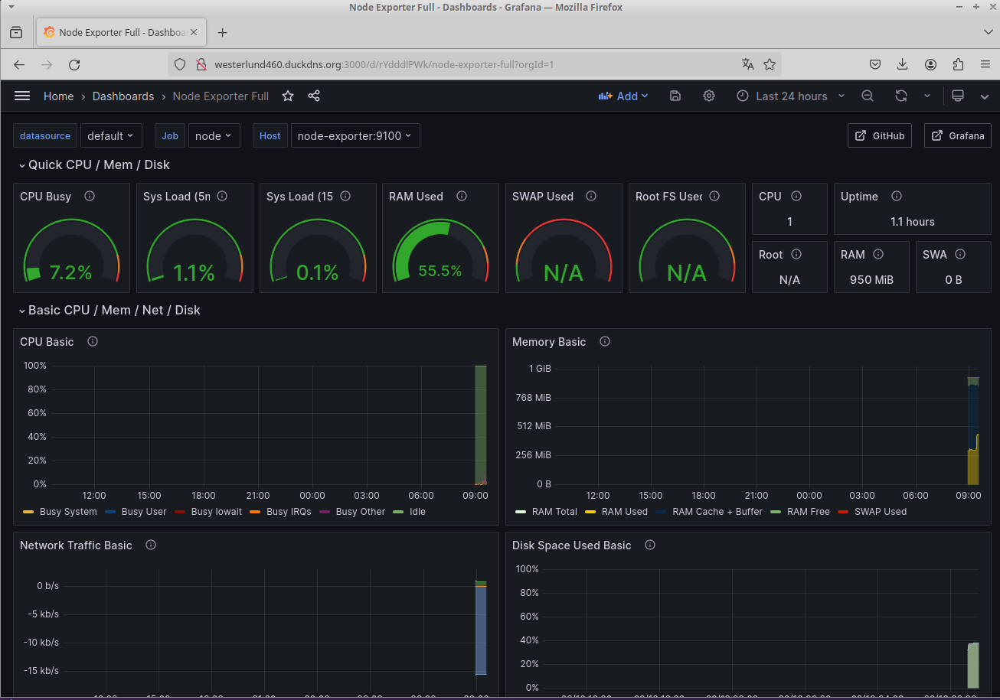

Ahora tenemos el docker monitorizado.
